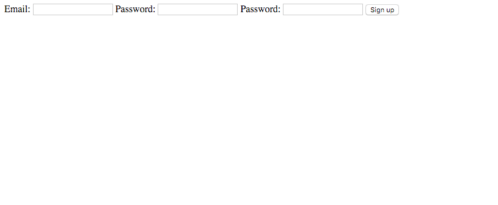
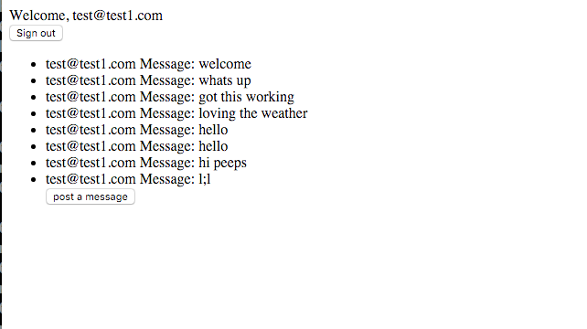
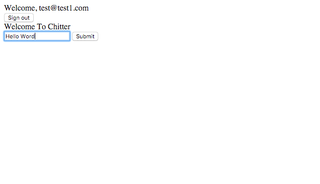
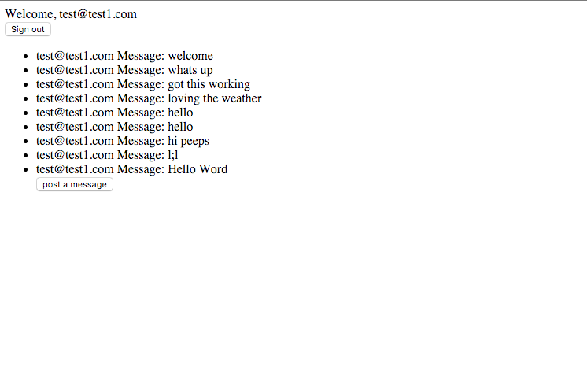

### Instructions

This was my 4th weekend challenge

To run this app open terminal and type

```
$ git clone https://github.com/jrose111284/chitter-challenge.git
$ bundle
$ create db chitter_development
$ rake db:auto_migrate RACK_ENV=development
$ rspec
$ rackup
```

Then type
```
ruby app/app
```
In your bower type

```
http://localhost:4567
```


fill in you email and password to sign up



once signed in it will take you to a chitter home page were you can see who has made posts



you can the click on the post a message if you want to post a Message



then it will take you back to the chitter home page



then you can click the sign out button

### not complete

I ran out of time to added css to this weekend challenge.
